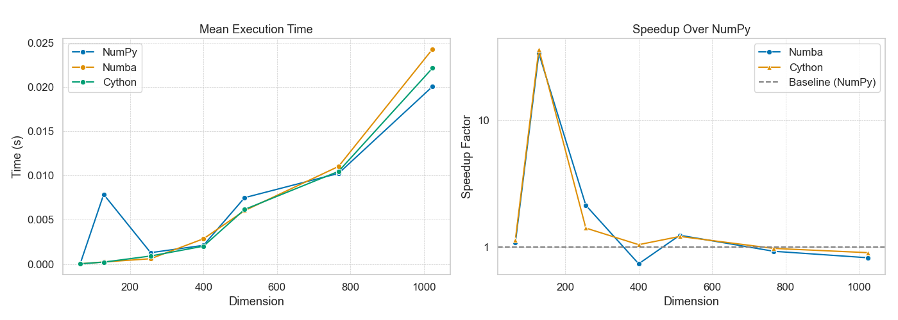

# Benchmark adaptatif pour le calcul de l'attention


## Objectif

Ce projet vise à calculer l'attention en optimisant le choix des paramètres de parallélisation pour minimiser le temps de calcul. À l'aide d'un benchmark adaptatif, nous cherchons à effectuer moins d'essais qu'une grille via trois variantes (NumPy, Numba, Cython) et trois stratégies d’optimisation de paramètres :

- **Bandit multibras**  
- **Optimisation bayésienne**
- **Algorithme génétique**

L’objectif est de minimiser le temps de calcul en trouvant automatiquement la meilleure configuration (nombre de threads, taille de bloc, etc.) sans passer par une grille exhaustive.

---

## Architecture du dépôt

    .
    ├── LICENSE
    ├── README.md                
    ├── Rapport.pdf              Rapport final du projet
    ├── requirements.txt         Dépendances Python
    ├── benchmark.py             Lancement des optimisations
    ├── compare_methods.py       Agrégation et comparaison des résultats
    ├── plots_summary.py         Génération des graphiques de synthèse
    ├── attention_functions/     Implémentations de la fonction “attention”
    │   ├── setup.py             Compilation de la version Cython
    │   ├── numpy_attention.py
    │   ├── numba_attention.py
    │   └── cytohn_attention.pyx
    └── results/                 Sorties : CSV, images, etc.

---

## Installation

1. **Cloner le dépôt**  
    ```bash
    git clone https://github.com/mekkilila/prog_parallele.git
    cd prog_parallele
    ```

2. **Créer un environnement virtuel**  
    ```bash
    python3 -m venv bench_env
    source bench_env/bin/activate (sur Mac ou Linux et bench_env\Scripts\activate sous Windows)
    ```

3. **Installer les dépendances**  
    ```bash
    pip install --upgrade pip
    pip install -r requirements.txt
    ```

4. **Compiler la version Cython**  
    ```bash
    cd attention_functions
    python setup.py build_ext --inplace
    ```

---

## Usage

1. **Lancer le benchmark**  
    - _Bandit multibras_ :  
        ```bash
        python benchmark.py --method bandit --output results/bandit.csv
        ```
    - _Optimisation bayésienne_ :  
        ```bash
        python benchmark.py --method bayes  --output results/bayes.csv
        ```
    - _Algorithme génétique_ :  
        ```bash
        python benchmark.py --method ga  --output results/ga.csv
        ```

2. **Comparer les méthodes**  
    ```bash
    python compare_methods.py \
      --bandit results/bandit.csv \
      --bayes  results/bayes.csv \
      --out    results/comparison.csv
    ```

3. **Générer les graphiques**
   Pour la méthode de bandit par exemple : 
    ```bash
    python plots_summary.py \
      --csv results/bandit.csv \
      --outdir results/plots
    ```

Les fichiers CSV et les images PNG/HTML sont déposés dans le dossier `results/`.

---

## Exemple de résultats




Amélioration notable du temps de calcul de la méthode statistique par rapport au calcul classique NumPy.

---

## Pistes d’évolution

- Intégrer d’autres algorithmes (recherche sur grille, évolution différentielle, CMA-ES…)
- Étendre au calcul de fonctions plus lourdes (convolutions, FFT, réseaux de neurones)
- Ajouter des critères multi-objectifs (temps vs mémoire vs précision)

---

## Auteurs 

Ce projet a été réalisé pour le cours de Programmation parallèle de 3A à l'ENSAE en collaboration entre : Delhommais Romain, Ligonniere Louise, Mekki Lila. 

---

## Licence

Ce projet est distribué sous licence **MIT**.  
Voir [LICENSE](LICENSE) pour plus de détails.
